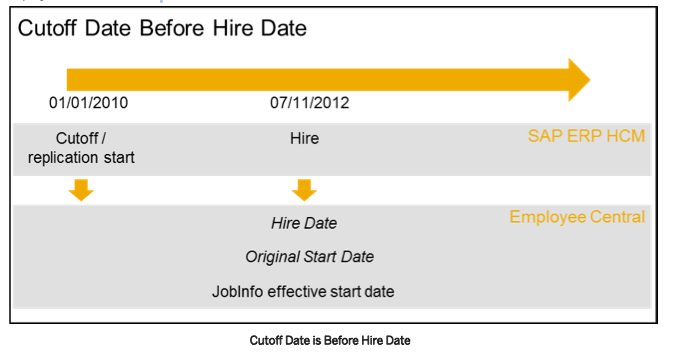
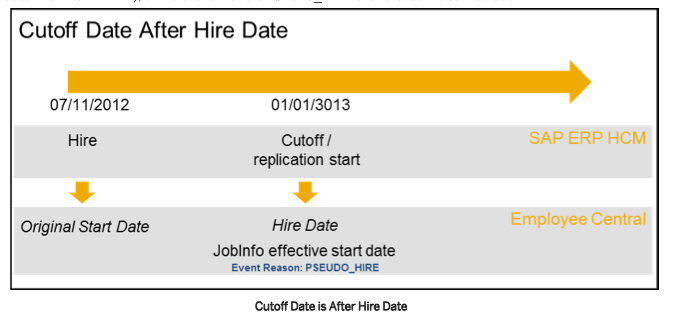
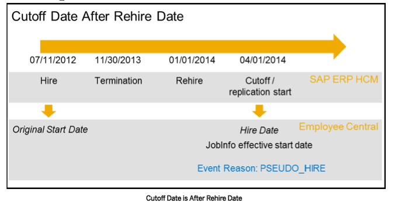
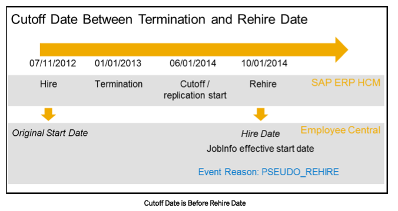

# Stage 1 – HR Data Migration
## KMZP HR Transformation: SAP S/4HANA HCM → SuccessFactors Employee Central

---

```table-of-contents
title: 
style: nestedList
minLevel: 0
maxLevel: 0
includeLinks: true
hideWhenEmpty: false
debugInConsole: false
```

## Table of Contents

### Part 1 – Architecture
1. Architecture Overview
2. Integration Flow: S4 → EC Migration

### Part 2 – Design Decisions
3. Migration Cutoff Date and FTSD
4. Employee Scope for Migration
5. Migration Events – Active Employees Being Migrated

### Part 3 – Org Migration
6. Org Object Migration Overview
7. EC Foundation Object Design for KMZP
8. Org Migration Process and Sequence
9. Transformation Templates for Org Objects
10. Org Object Key Mapping

### Part 4 – Employee Data Replication
11. Infoporter Architecture and Extraction
12. Employee Identifier Strategy
13. Infotype Mapping to EC Entities
14. Event Reason Setup in EC
15. Running the Migration
16. Validation and Error Handling

---

---

## PART 1 – Architecture

---

## 1. Architecture Overview

KMZP is implementing a **Core Hybrid** model. This document covers **Stage 1 — the one-time initial migration of HR data from SAP S/4HANA HCM (on-premise) into SuccessFactors Employee Central (EC)**. This migration is the prerequisite before ongoing replication (Stage 2) can begin.

**The two-phase boundary:**

| Phase | Direction | Tool | Nature |
|-------|-----------|------|--------|
| Stage 1 (this document) | S4 → EC | **SAP Infoporter (ECPAO)** | One-time initial load |
| Stage 2 (next document) | EC → S4 | **BIB + Compound Employee API + CPI** | Ongoing delta replication |

**Why migrate from S4 to EC first?**
- EC becomes the **system of record** for HR master data from go-live day onwards
- EC needs a complete, accurate picture of all existing employees, positions, and org structure
- Without this migration, EC would have no history — new hires would appear correct but all existing employees would have to be re-entered manually

**What Infoporter does:**
SAP Infoporter is an SAP-delivered extraction and migration tool (ECPAO framework) that:
1. Reads OM and PA infotypes directly from the S4 HCM database
2. Applies configurable field mapping (infotype mapping, evaluation path mapping, custom mapping)
3. Generates CSV load files per EC entity type
4. Sends data to EC via the EC OData/SOAP APIs

Infoporter is **not** CPI — it communicates directly with EC from the S4 application server.

---

## 2. Integration Flow: S4 → EC Migration

### 2.1 High-Level Flow

```
S4 HCM (on-premise)
  ├── OM Tables (HRP1000, HRP1001, HRP1002)
  └── PA Infotypes (PA0000–PA0041, PA0105, PA0185...)
        │
        ▼ [Infoporter extracts via ECPAO programs]
  Transformation Template Group (TTG)
  ├── Org templates (ERP_BUS_UNIT, ERP_DIVISION, ERP_DEPARTMENT, ERP_JOB, ERP_POSITION)
  └── Employee templates (WS_2, WS_3, WS_4, WS_5, WS_7, WS_8, WS_10, WS_11, WS_12...)
        │
        ▼ [Field mapping, value mapping, evaluation path mapping applied]
  ECPAO_EE_INVT / ECPAO_INVT (staging inventory tables)
        │
        ▼ [EC OData/SOAP API calls]
  SuccessFactors Employee Central
  ├── Foundation Objects (Business Unit, Division, Department, Job Code)
  ├── Position Management (Positions)
  └── Employee Master Data (Person Profile, Job Info, Compensation, Bank Details...)
        │
        ▼ [After initial migration is verified]
  Key Mapping Tables pre-loaded:
  ├── SFIOM_KMAP_OSI (EC org code ↔ S4 OM OBJID)
  └── PAOCFEC_EEKEYMAP (EC Employment ID ↔ S4 PERNR)
```

### 2.2 Key Infoporter Programs

| Program | T-Code | Purpose |
|---------|--------|---------|
| `ECPAO_OM_OBJECT_EXTRACTION` | – | Extracts OM objects (O, C, S) and sends to EC |
| `ECPAO_EMPL_EXTRACTION` | `ECPAO_EE_EXTR` | Extracts employee infotypes and sends to EC |
| `ECPAO_PICKLIST_WRITER` | – | Imports EC picklist values into S4 tables before mapping |
| `ECPAO_ECTMPL_METADATA_WRITER` | – | Imports EC entity metadata (field list for templates) |
| `ECPAO_MNGR_TYPES_EXTRACTION` | – | Extracts employee-manager assignments |
| `ECPAO_EMPL_DMT_JOB_SCHEDULER` | – | Job scheduler for employee data migration (supports delta mode) |
| `ECPAO_OM_INVENTORY_ALV` | – | Report to view all inventory/error tables |
| `RBDMIDOC` | BD21 | Generate change pointers for delta employee extraction |

### 2.3 Key Inventory and Staging Tables

| Table | Purpose |
|-------|---------|
| `ECPAO_EE_INVT` | Inventory of employee objects extracted (per PERNR, entity type, extract timestamp) |
| `ECPAO_INVT` | Inventory of EC entities replicated (confirmation from EC side) |
| `ECPAO_INVT_MSG` | Error messages per EC entity during migration |
| `SFIOM_KMAP_OSI` | Key mapping: EC org external code ↔ S4 OM OBJID |
| `PAOCFEC_EEKEYMAP` | Key mapping: EC Employment ID / User ID ↔ S4 PERNR |
| `ECPAO_PIKLST_ENT` / `ECPAO_PIKLST_VAL` | Picklist entities and values imported from EC |
| `ECPAO_EE_MGNR` | Employee-manager assignments (extracted by ECPAO_MNGR_TYPES_EXTRACTION) |

---

---

## PART 2 – Design Decisions

---

## 3. Migration Cutoff Date and FTSD

### 3.1 The Two Key Dates Explained

There are TWO separate "start dates" in a Core Hybrid implementation. Confusing them is a very common mistake:

| Date | What it is | Where configured | Controls |
|------|-----------|-----------------|---------|
| **Migration Cutoff Date** | The date used by Infoporter when migrating data FROM S4 TO EC | Infoporter migration run parameter | How much history is extracted from S4 and put into EC |
| **FTSD (Full Transmission Start Date)** | The date used by BIB when replicating data FROM EC BACK TO S4 | BIB Transformation Template Group | Which EC data slices are replicated to S4 |

**The FTSD must be the same as or later than the migration cutoff date. Never earlier.**

### 3.2 Migration Cutoff Date – What It Does

### What Happens for Initial Data Extraction?

This is what happens when you initially extract the data:

- #### Effective-dated templates:
    
    For effective-dated templates, if the earliest transfer date is after the hire or rehire date of an employee, the employee's data is extracted starting with the earliest transfer date. (This is also true for Non-Recurring Payments.) The following situations might occur:
    
    - The employee is active on the earliest transfer date: In this case, the data is extracted starting with the earliest transfer date for all effective-dated templates and Non-Recurring Payments.
        
    - The employee is terminated or retired on the earliest transfer date and hired or rehired later: In this case, the data is extracted starting with the hire or rehire date for all effective-dated templates and Non-Recurring Payments.
        
    - The employee is terminated or retired on the earliest transfer date and isn't rehired: In this case, no data is extracted for all effective-dated templates and Non-Recurring Payments.
        
- **Non-effective dated templates**
    
    - **When an employee is hired in the past/present**:
        
        For all other noneffective dated templates, when the employee is hired in the past or present, data is extracted starting with the later of the two dates. That is, either the current date or the earliest transfer date. If the earliest transfer date is after the date on which you run the data extraction program (the earliest transfer date is in the future), then the earliest transfer date is used for data extraction. If the earliest transfer date is before, then the date on which you run the data extraction program is used instead.
        
    - **When an employee is hired in the future**:
        
        For all other noneffective dated templates when the employee is hired in the future, the hire date is used for data extraction.
        
    
    - For **Employment Termination**, the last terminated data record for an employee is extracted. This is independent of the earliest transfer date or the date on which you run the data extraction program.
        
    - For **Global Assignment**, the last record of the employee's **Details on Global Assignment**(0710) infotype is extracted. This is independent of the earliest transfer date or the date on which you run the data extraction program. If the earliest transfer date is between the start and end date of the host assignment, the _Job Information_ record is extracted for the host assignment. The PSEUDO_ADDGA event reason is used for the **Add Global Assignment** event.
        
- If the earliest transfer date is greater than the future cutoff date, then the earliest transfer date is considered during the data extraction.

**Concepts**









When Infoporter runs with a cutoff date of, say, January 1, 2025:

| Employee Record Type                                                 | What Happens                                                                          |
| -------------------------------------------------------------------- | ------------------------------------------------------------------------------------- |
| Records whose end date < cutoff date (historical, closed records)    | **Ignored** (not sent to EC)                                                          |
| Records spanning the cutoff (begin date < cutoff, end date > cutoff) | **Split at the cutoff date**. The slice from cutoff to 9999 is sent to EC.            |
| Future-dated records (begin date > cutoff)                           | **Sent to EC as-is**                                                                  |
| Initial "anchor" hire record                                         | Created from original hire date to cutoff date-1 with event H, event reason MIGRATION |

**KMZP project dates:**

| Date                  | Value                           |
| --------------------- | ------------------------------- |
| Project start         | 2026-01-01                      |
| Migration cutoff date | **2027-01-01** (= go-live date) |
| FTSD                  | **2027-01-01** (= go-live date) |
| Go-live               | **2027-01-01**                  |

> **Why is the cutoff set to go-live (2027-01-01) and not project start (2026-01-01)?**
> The cutoff defines the "snapshot date" EC receives as its starting state. Setting it to go-live (2027-01-01) means EC gets the exact picture of S4 on the day EC takes over as system of record. Setting it to project start (2026-01-01) would mean EC's starting state is a year old by the time go-live arrives — all changes made in S4 during 2026 would need to be captured through delta runs and reconciled. The clean approach is: cutoff = FTSD = go-live.
>
> The 12-month window for terminated employees is always measured **backwards from the cutoff date**. With cutoff = 2027-01-01, employees terminated from 2026-01-01 onwards are in scope.

**Visual example — KMZP active employee hired in 2018:**

| EC Job Slice           | Event       | Event Reason | Start                      | End                     | Status |
| ---------------------- | ----------- | ------------ | -------------------------- | ----------------------- | ------ |
| Slice 1 (anchor)       | H           | MIGRATION    | 2018-03-15 (original hire) | 2026-12-31 (cutoff − 1) | Active |
| Slice 2 (cutoff slice) | Data Change | DATALOAD     | 2027-01-01 (cutoff)        | 9999-12-31              | Active |

The anchor slice (Slice 1) tells EC when the employee was originally hired. This preserves the original hire date in EC's employment record without flooding EC with years of job changes.

### 3.3 FTSD – What It Does and Why It Cannot Be Changed

The FTSD is set in the **Transformation Template Group** in BIB (field: Earliest Transfer Date).

**Rules:**
- Data in EC with effective dates BEFORE the FTSD is **never replicated** to S4 by the BIB integration
- Data in EC from FTSD onwards is replicated
- **Once set, the FTSD cannot be changed.** It is the permanent anchor for all delta runs. Changing it would break the delta chain.

**Initial Run behaviour:**
The first time the replication runs (initial run), it replicates data slices from FTSD to high date (9999). Critically:
- Infotype records are NOT automatically split at the FTSD
- Splitting only happens if the EC data differs from what was migrated into S4 (data divergence causes a new start of a time slice)
- This avoids unnecessary retro-calculation in payroll

**What the initial run actually does:**
- Levels the data between EC and S4 (makes them consistent from FTSD onwards)
- Establishes the first Last Run Date (LRD)
- Populates the key mapping tables if not already done

**Delta Runs (ongoing):**
After the initial run, every subsequent run uses the LRD (Last Run Date) from the previous successful run. The LRD advances with each run, ensuring only genuinely new/changed data is processed.

### 3.4 Recommended FTSD for KMZP

**KMZP Decision:**

| Parameter | Value |
|-----------|-------|
| Go-Live Date | 2027-01-01 |
| FTSD | **2027-01-01** |
| Migration Cutoff Date | **2027-01-01** |

All three are set to the same date. This is the recommended and cleanest approach: EC takes over as system of record on 2027-01-01, and that is also the date from which all replication and migration anchors.

**Why:** Data before 2027-01-01 was managed in S4. Data from 2027-01-01 onwards is managed in EC. Setting FTSD = cutoff = go-live creates a clean, unambiguous handoff boundary.

> **Common misconception:** The cutoff date is NOT the project start date (2026-01-01). Setting cutoff = 2026-01-01 would mean Infoporter takes a snapshot of S4 as it was on project start day. All 2026 HR changes (new hires, promotions, terminations during the year) would then need to be captured via delta runs and carefully reconciled before go-live. This is error-prone and unnecessary. Setting cutoff = go-live means the single initial migration run (plus final delta catches in the weeks before go-live) gives EC the exact state of S4 on the day it goes live.

**12-month window for terminated employees (KMZP):**

With cutoff = 2027-01-01, the in-scope window for terminated employees is:

| Window | Date Range |
|--------|-----------|
| In scope (terminated within 12 months) | 2026-01-01 to 2026-12-31 |
| Out of scope (terminated > 12 months before cutoff) | Before 2026-01-01 |

**Practical considerations:**
- For terminated employees being migrated (terminated between 2026-01-01 and 2026-12-31): their termination is before FTSD, so their termination data in EC will NOT be replicated back to S4. Their status in S4 must already be "terminated" from the original SAP history. Their PERNR is pre-loaded in `PAOCFEC_EEKEYMAP` so post-go-live corrections (T4 amendments, retro disputes) can still flow from EC to S4.
- For terminated employees NOT migrated (terminated before 2026-01-01): they exist only in S4. No post-go-live EC-to-S4 corrections are possible through the integration for these employees. Any corrections must be made directly in S4.
- For employees on LOA at cutoff: their LOA status is included in the cutoff-date data slice sent to EC, and is replicated back to S4 via the initial run.

---

## 4. Employee Scope for Migration

### 4.1 Who to Include in the Migration to EC

| Employee Category                                                 | Include?               | Notes                                                                                                                             |
| ----------------------------------------------------------------- | ---------------------- | --------------------------------------------------------------------------------------------------------------------------------- |
| **Active employees**                                              | Yes                    | All employees currently working                                                                                                   |
| **Employees on Leave of Absence** (LOA, parental leave, STD, LTD) | Yes                    | They have active employment in S4 (status 3 or 4). EC should show them on leave. Include the LOA status in the cutoff-date slice. |
| **Terminated within last 12 months**                              | **Yes**                | T4 issuance, ROE re-issuance, retro-payroll disputes, and vacation pay late payouts may still apply. See Section 4.2 for detail.  |
| **Terminated between 12 months and 2 years ago**                  | **No** (KMZP decision) | Prior tax year is closed. No retro-payroll expected. No ROE outstanding. Excluded from scope.                                     |
| **Terminated > 2 years ago**                                      | **No**                 | Excluded from scope. If rehired post-go-live, treated as a new hire with a new PERNR.                                             |
| **Retirees (status = Retiree in S4)**                             | Discuss                | If receiving pension through SAP payroll, include. Otherwise exclude.                                                             |
| **Future hires (start date after cutoff)**                        | Yes                    | If already entered in EC for onboarding, include                                                                                  |
| **Contingent workers / contractors**                              | Discuss                | Scope depends on whether they are in S4 today and whether EC will manage them                                                     |

### 4.2 Handling Terminated Employees in Migration

**Concepts**

When an employee is terminated, his or her assigned position, job code, division, department, business
unit, and cost-center information remains in Job Information in Employee Central. In the SAP S∕4HANA
system, however, a terminated employee has a default position assigned, and job, organizational unit, and cost-
center assignments are removed from the Organizational Assignment (0001) infotype. If this information was
replicated to Employee Central, the assignments are also removed from the employee's Job Information. This
is the reason why the SAP S∕4HANA system migrates the corresponding assignments from the employee's last
active Organizational Assignment record instead of from the terminated one.


#### KMZP Scope Decision

**Only employees terminated within the last 12 months (relative to the migration cutoff date) are in scope for migration.**

Employees terminated more than 12 months before the cutoff date are excluded. The rationale:
- The prior tax year is closed — no T4 amendments are expected
- ROE issuance for these employees is complete
- No retro-payroll calculations will reach back beyond 12 months
- The effort and risk of migrating stale terminated records outweighs any benefit

#### Why Migrate Employees Terminated Within the Last 12 Months

These employees have live payroll obligations that extend beyond their termination date:

- **T4/RL-1 issuance and amendments**: T4s for the current tax year are issued in February/March. If an error is found post-go-live, the correction must originate in EC (as the new system of record) and flow back to S4 via BIB. The employee record must exist in EC for this flow to work.
- **Retro-payroll disputes**: A terminated employee may dispute their final pay, or a late salary adjustment may be discovered. Retro runs in S4 require the correction trigger to come from EC.
- **ROE re-issuance**: Service Canada may request an amended ROE within 12 months of termination.
- **Vacation pay late payouts**: Outstanding vacation pay owing may be identified during reconciliation and paid out after termination.

#### How to Load These Terminated Employees into EC

They are migrated with their final employment snapshot (last active IT0000/IT0001 records) and shown as terminated in EC:

1. Load the anchor hire record (event = H, event reason = MIGRATION) — from original hire date to cutoff date − 1 day
2. Load the final employment record (cutoff slice) — reflecting their last active org assignment
3. Load a Termination event in EC — either as a historical event (if terminated before cutoff) or as a replicated event (if terminated after cutoff)

In EC, these employees will appear with status **Terminated / Inactive**.

#### For Employees Terminated BEFORE the Cutoff Date (but within 12 months)

- EC loads their status as Terminated (Inactive)
- Their PERNR in S4 remains terminated — no new action is created
- `PAOCFEC_EEKEYMAP` is pre-loaded with their PERNR so any post-go-live correction in EC correctly targets the existing PERNR
- No ongoing replication occurs (termination date < FTSD, so BIB will not process them)
- Any post-go-live payroll corrections (T4 amendment, retro dispute) are triggered from EC → S4 via an EC event dated after the FTSD

#### For Employees Terminated AFTER the Cutoff Date

- They are active in EC at the cutoff date (migrated as active)
- Their termination occurs in EC post-go-live
- EC sends the termination event to S4 via BIB replication
- IT0000 in S4 gets a Termination action (MASSN 34 or 33 depending on event reason)

#### Example: Terminated Employee Within 12 Months (KMZP)

**Employee:** Jane Doe, PERNR `00001234`
**Original hire date:** 2018-03-15
**Voluntary resignation:** 2026-09-30 (S4 Action Type MASSN = 34)
**Migration cutoff:** 2027-01-01
**FTSD / Go-live:** 2027-01-01

Jane resigned on 2026-09-30 — 3 months before the cutoff. She is within the 12-month window (2026-01-01 to 2026-12-31) and is therefore in scope.

**EC Job Information slices after Infoporter:**

| Slice | Event | Event Reason | Start Date | End Date | EC Employment Status |
|-------|-------|-------------|-----------|---------|---------------------|
| **1 — Anchor** | H (Hire) | MIGRATION | 2018-03-15 | 2026-09-29 (termination − 1) | Active |
| **2 — Termination** | T (Termination) | TERRTM (Voluntary Resignation) | 2026-09-30 | 9999-12-31 | **Inactive / Terminated** |

> **Why only 2 slices?** Jane terminated before the cutoff date. There is no cutoff-date slice (DATALOAD) because she was not active on 2027-01-01. The anchor ends the day before her termination; the termination event is the final slice. Compare this to an active employee who gets an anchor (ending 2026-12-31) plus a DATALOAD cutoff slice (starting 2027-01-01).

**PAOCFEC_EEKEYMAP entry pre-loaded before go-live:**

| EC Employment ID | EC User ID | S4 PERNR | Company Code |
|-----------------|-----------|---------|-------------|
| EMP00001234 | jdoe@kmzp.com | 00001234 | KMZP |

**Replication behaviour after go-live:**

| Scenario | BIB Replicates to S4? | Why |
|----------|----------------------|-----|
| Initial BIB run (2027-01-01) | No | Termination date (2026-09-30) < FTSD (2027-01-01). BIB ignores all EC records before FTSD. |
| Ongoing delta runs | No | Same reason. Jane's termination status in S4 comes from the original S4 history, not from BIB. |
| T4 amendment filed Feb 2027 — HR corrects her final salary in EC | Yes | The EC correction is dated after FTSD (2027-01-01). BIB picks it up, updates IT0008 in S4, retro payroll runs. |
| Jane is rehired in March 2027 | Yes | BAdI finds her PERNR in `PAOCFEC_EEKEYMAP` → Rehire action (MASSN 40) written to IT0000. Jane keeps her original PERNR and service history. |

**IT0000 in S4 after migration (unchanged — Infoporter does not touch IT0000):**

| MASSN | Description | Start | End |
|-------|-------------|-------|-----|
| 01 | Hiring | 2018-03-15 | 2026-09-29 |
| 34 | Voluntary Resignation | 2026-09-30 | 9999-12-31 |

**Summary of the two slice patterns:**

For any employee terminated **before** the cutoff:
```
Slice 1 (Anchor)      →  H / MIGRATION  →  Hire date  to  Termination date − 1  →  Active
Slice 2 (Termination) →  T / TERRTM     →  Termination date  to  9999            →  Inactive
```

For an active employee (terminated **after** the cutoff, or still active):
```
Slice 1 (Anchor)       →  H / MIGRATION  →  Hire date    to  2026-12-31  →  Active
Slice 2 (Cutoff slice) →  DC / DATALOAD  →  2027-01-01  to  9999         →  Active
[Post go-live, if terminated in EC]
Slice 3 (Termination)  →  T / TERRTM     →  Termination date  to  9999   →  Inactive  (via BIB)
```

---

#### Excluded: Employees Terminated More Than 12 Months Ago

These employees are **not migrated** to EC. They remain only in S4 as historical records. Consequences to acknowledge:
- If one of these employees is rehired post-go-live, they will be treated as a **new hire** (new PERNR) since no entry exists in `PAOCFEC_EEKEYMAP` for them. The rehire team must be aware of this and manually link prior service history if needed.
- No T4 amendments, ROE, or retro-payroll for these employees will be processed through EC. Any such edge case must be handled directly in S4 (outside the Core Hybrid integration flow).

### 4.3 Leave of Absence Employees – Special Consideration

LOA employees have **active employment** in EC/S4 but with an inactive payroll status. During migration:
- Their IT0000 in S4 shows a Leave of Absence action (e.g., action type 14)
- Their IT0001 is still active
- EC should show them in their LOA status (using EC's leave of absence feature)
- The LOA start date and return date need to be in EC (either as leave requests or job information event)

For payroll purposes, these employees may be:
- On reduced pay (partial payroll run)
- On no pay (status 4 in S4, payroll not triggered)
- On disability pay from insurance (outside of payroll)

Ensure the EC data for these employees reflects the correct LOA status so that when replicated, IT0000 has the correct action and payroll area remains correct (YB/YW).

---

## 5. Migration Events – Active Employees Being Migrated

### 5.1 The Migration Event Pattern

When active employees are migrated from S4 to EC and then the replication runs back to S4, they do NOT go through a standard "hire" action in S4. The key mapping table (`PAOCFEC_EEKEYMAP`) is pre-loaded with their existing PERNRs. Therefore:

- The replication finds their PERNR in the key mapping table → treats them as **existing employees**
- It performs **infotype UPDATES** (not hiring actions)
- IT0000 is NOT updated with a new action — the existing historical actions in S4 are preserved
- The replication only makes changes where EC data differs from S4 data

**In simple terms:** For an employee who has been in S4 for 10 years, the initial replication run does NOT re-hire them. It just refreshes their current infotype data from EC.

### 5.2 Migration Event Reason in EC (for the EC Side)

In EC's Job History, every employment must have a starting event. For migrated employees, this is the "anchor" job slice created by Infoporter:

| EC Event Field | Recommended Value | Notes |
|---------------|------------------|-------|
| Event (`event`) | H (Hire) | Standard EC hire event code |
| Event Reason (`eventReason`) | MIGRATION or DATALOAD | Custom event reason created specifically for migration; does NOT map to a specific S4 action since these employees already exist in S4 |

**Configure this event reason in EC:** Admin Center → Event Reason → Create new event reason (e.g., code: DATALOAD, label: "Data Load - Migration"). Map it in BIB value mapping entity `EVENT_REASON`:

| EC eventReason | S4 MASSN | Notes |
|---------------|---------|-------|
| DATALOAD | 01 (Hiring) | BUT: only fires if the employee is NEW (not in key mapping table). For existing employees, this mapping is bypassed. |

### 5.3 What Action Should Active Migrated Employees See in IT0000 on Go-Live Day?

**Answer:** No new action is created in IT0000 for employees who already exist in S4.

Their IT0000 history in S4 remains exactly as it was from the original SAP system. The initial replication run may update IT0001, IT0002, IT0006, IT0007, IT0008, IT0009, IT0105 etc., but it does NOT insert a new row in IT0000.

**When does a new IT0000 record get created?**
Only when EC sends a new event AFTER the go-live FTSD that represents an actual HR action (hire, transfer, promotion, termination, etc.). These are genuine business events, not migration artifacts.

### 5.4 Truly New Employees (First-Time Hires After Go-Live)

For employees hired into EC for the first time AFTER the FTSD (not previously in S4):
- Their employment does NOT exist in the key mapping table
- BAdI `EX_PAOCF_EC_DECIDE_HIRE_REHIRE` is called → determines it's a genuine new hire
- A new PERNR is created in S4
- IT0000 gets a Hiring action (Action Type 01)
- The event reason from EC (e.g., HIREMP) → MASSN 01 via EVENT_REASON value mapping

### 5.5 Special EC Event Reasons Required for Migration

The following event reasons must be created in EC Admin Center before Infoporter runs:

| EC Event Reason Code | Purpose | When Used |
|---------------------|---------|-----------|
| **MIGRATION / DATALOAD** | Marks the anchor hire record in EC for all migrated employees | Infoporter anchor slice (Slice 1) |
| **PSEUDO_HIRE** | Used when an employee was terminated before FTSD but rehired after FTSD; the earliest transfer date falls after the termination and before the rehire | Rehire scenario where old employment predates FTSD |
| **PSEUDO_REHIRE** | Used when the earliest transfer date falls after the rehire date | Rehire scenario where FTSD postdates rehire |
| **DATACHG** | Used when there is a change in an EC field value between consecutive records in the Job Info template but no formal HR action | Data change without event |
| **REHINT** | Used for rehires during international transfers | International assignment rehire |

### 5.6 Summary Table: Which Employees Get What in IT0000 on Go-Live

| Employee Type | PERNR in Key Mapping? | IT0000 Effect | Notes |
|--------------|----------------------|--------------|-------|
| Active employees migrated via Infoporter | Pre-loaded | No new action | Initial run updates other infotypes only |
| Employees on LOA, migrated | Pre-loaded | No new action | LOA status preserved from S4 history |
| Terminated employees (terminated BEFORE FTSD), migrated — **within 12 months of cutoff only** | Pre-loaded | No new action | Termination remains from S4 history; EC shows Inactive/Terminated status |
| Terminated employees — **terminated more than 12 months before cutoff** | **Not loaded** | No action (not in scope) | Not migrated to EC; if rehired post-go-live, treated as new hire with new PERNR |
| New hires AFTER FTSD (fresh from EC) | Not loaded | New HIRE action (01) in IT0000 | Standard new hire flow |
| Rehires AFTER FTSD (new employment, was previously terminated) | May or may not be loaded | Rehire action (40) OR new hire (01) depending on BAdI logic | See PSEUDO_HIRE / PSEUDO_REHIRE event reasons |

---

---

## PART 3 – Org Migration

---

## 6. Org Object Migration Overview

### 6.1 What Must Be Migrated

Before any employee data can be loaded into EC, the org foundation must exist. EC requires that positions, departments, divisions, business units, and job codes are all pre-loaded before employees can be assigned to them.

**Minimum required for migration:**

> Position, Department, Job Code (minimum set)
> Business Unit and Division are required if the KMZP EC org hierarchy uses all three levels.

**KMZP decision:** Migrate all five org levels — Business Unit, Division, Department, Job Code, Position — to fully reflect the S4 OM hierarchy in EC.

### 6.2 S4 OM Object Types → EC Foundation Objects

| S4 OM Object Type | S4 Description | EC Foundation Object | EC Entity API Name |
|-------------------|---------------|---------------------|-------------------|
| O (top-level org unit) | Business Unit | Business Unit | `BusinessUnit` |
| O (mid-level org unit) | Division | Division | `Division` |
| O (department-level) | Department | Department | `Department` |
| C | Job (catalog) | Job Classification / Job Code | `JobCode` |
| S | Position | Position | `Position` |
| K | Cost Center | (not migrated — already in FI; mapped by key) | – |

**Important:** All three S4 org unit levels (Business Unit, Division, Department) are all object type **O** in S4. Infoporter uses the BAdI `EX_ECPAO_EMP_VALIDITY_TAB` to decide which EC entity each specific OM org unit maps to. Without this BAdI, Infoporter cannot distinguish between a Business Unit O-object and a Department O-object.

### 6.3 KMZP Org Object Scope

Based on the Phase 1 design (Stage 7 OM configuration):

| S4 Org Level | Count | Example S4 IDs | EC Target |
|-------------|-------|---------------|-----------|
| Business Unit (top O) | 1 | KMZP root org unit | Business Unit |
| Division (mid O) | ~3 | Corporate, Operations, Technology | Division |
| Department (dept O) | ~15 | 15 org units (50001802–50001816) | Department |
| Job (C) | 7 | CEXE, CDIR, CMAN, CSPE, CANA, CASS, CONT | Job Code |
| Position (S) | 13 | 600001–600013 | Position |

---

## 7. EC Foundation Object Design for KMZP

### 7.1 Business Unit

EC Foundation Object: `BusinessUnit`

| Field | Value | Source |
|-------|-------|--------|
| External Code | Derived from S4 Org Unit OBJID (root org unit) | HRP1000 OBJID |
| Name | "KMZP Consulting" | HRP1000 STEXT |
| Parent Business Unit | – (root level) | – |
| Effective Start | Phase 1 go-live date | HRP1000 BEGDA |
| Status | Active | – |

### 7.2 Division

EC Foundation Object: `Division`

| Field | Value | Source |
|-------|-------|--------|
| External Code | Derived from S4 Org Unit OBJID (division-level O) | HRP1000 OBJID |
| Name | Division name (e.g., Corporate, Operations, Technology) | HRP1000 STEXT |
| Parent Business Unit | Code of the parent Business Unit | HRP1001 A002 relationship |
| Effective Start | HRP1000 BEGDA | |

### 7.3 Department

EC Foundation Object: `Department`

| Field | Value | Source |
|-------|-------|--------|
| External Code | Derived from S4 Org Unit OBJID | HRP1000 OBJID |
| Name | Department name | HRP1000 STEXT (infotype 1000) |
| Description | Long description | HRP1002 TLINE (infotype 1002, subtype 0001) |
| Parent Division | Code of parent Division | HRP1001 A002 relationship |
| Parent Department | Code of parent Department (if nested) | HRP1001 A002 (same-type) |
| Cost Center | From cost center assignment | HRP1001 A011 relationship → PAOCFEC_KMAPCOSC |
| Effective Start | HRP1000 BEGDA | |

**Conditional mapping note:** A Department can report to a Division OR to another Department. The template uses conditional mapping:
- If `parentDepartment` is NOT null → A002 points to parent Department
- If `parentDepartment` IS null → A002 points to parent Division

### 7.4 Job Code

EC Foundation Object: `JobCode`

| Field | Value | Source |
|-------|-------|--------|
| External Code | S4 Job C-object OBJID (e.g., 70000001) | HRP1000 OBJID |
| Name | Job name (e.g., "Executive", "Manager") | HRP1000 STEXT |
| Job Function | Map from job catalog grouping (if applicable) | Custom mapping |
| Effective Start | HRP1000 BEGDA | |

**KMZP Job Code mapping:**

| S4 Job OBJID | S4 STEXT | EC JobCode External Code | EC Job Name |
|-------------|----------|--------------------------|-------------|
| CEXE (or assigned number) | Chief Executive | CEXE | Chief Executive |
| CDIR | Director | CDIR | Director |
| CMAN | Manager | CMAN | Manager |
| CSPE | Specialist | CSPE | Specialist |
| CANA | Analyst | CANA | Analyst |
| CASS | Associate | CASS | Associate |
| CONT | Contractor | CONT | Contractor |

### 7.5 Position

EC Foundation Object: `Position`

| Field | Value | Source |
|-------|-------|--------|
| External Code | S4 Position S-object OBJID (e.g., 60000001) | HRP1000 OBJID |
| Position Title | Position name | HRP1000 STEXT |
| Job Code | Job linked to this position | HRP1001 A007 (Position → Job, eval path B007) |
| Department | Department this position belongs to | HRP1001 A003 (Position → Org Unit) |
| Reports To (Manager Position) | Parent position | HRP1001 A002 (Position → Position) |
| Cost Center | Cost center assignment | HRP1001 A011 → PAOCFEC_KMAPCOSC |
| FTE | Position FTE (default 1.0 unless explicitly set) | IT1005 or default |
| Effective Start | HRP1000 BEGDA | |

---

## 8. Org Migration Process and Sequence

### 8.1 Pre-Migration Setup (S4 side)

1. **Import EC metadata** — run `ECPAO_ECTMPL_METADATA_WRITER` with the OData API metadata XML exported from EC Admin Center. This populates ECPAO_FLD (field list for templates).
2. **Import EC picklists** — run `ECPAO_PICKLIST_WRITER`. Tables `ECPAO_PIKLST_ENT` and `ECPAO_PIKLST_VAL` are populated.
3. **Configure Transformation Template Group** — create TTG with a group ID (e.g., KMZP_ORG_01), EC instance ID, and cutoff date.
4. **Create and activate org transformation templates** — one per org object type (see Section 9).
5. **Configure value mapping entities** — especially `Organizational Object Keys from Mapping Table` type for org units.
6. **Implement BAdI `EX_ECPAO_EMP_VALIDITY_TAB`** — to distinguish which S4 O-type org units map to Business Unit vs Division vs Department in EC.

### 8.2 Pre-Migration Setup (EC side)

1. **Enable Foundation Objects** in EC Admin Center — ensure Business Unit, Division, Department, Job Code, Position portlets are active.
2. **Configure Position Management** in EC — enable `Position Management` if not already on.
3. **Create custom event reasons** — MIGRATION, DATALOAD, PSEUDO_HIRE, PSEUDO_REHIRE, DATACHG (see Section 5.5).
4. **Replicate Cost Centers** — cost centers must be replicated from S4 FI to EC first (via FI-EC Cost Center replication or manual load). They are NOT migrated by Infoporter but must exist in EC before org objects that reference cost centers are loaded.

### 8.3 Migration Execution Sequence

**This sequence is mandatory — each step depends on the previous one:**

```
Step 1:  Load Cost Centers to EC (FI replication or manual — prerequisite)
Step 2:  Migrate Org Units WITHOUT parent relationships
           → Run ECPAO_OM_OBJECT_EXTRACTION for Business Units (no parent)
           → Run ECPAO_OM_OBJECT_EXTRACTION for Divisions (no parent yet)
           → Run ECPAO_OM_OBJECT_EXTRACTION for Departments (no parent yet)
Step 3:  Migrate Jobs WITHOUT relationships
           → Run ECPAO_OM_OBJECT_EXTRACTION for Job Codes (no parent)
Step 4:  Migrate Positions WITHOUT relationships
           → Run ECPAO_OM_OBJECT_EXTRACTION for Positions (no parent yet)
Step 5:  Migrate Employees (job_information links them to positions)
           → Run ECPAO_EMPL_EXTRACTION
Step 6:  Replicate Org Unit Relations (parent-child A002)
           → Re-run with relationship templates active
Step 7:  Replicate Job Relations (Job → Parent Job if applicable)
Step 8:  Replicate Position Relations (S-O, S-C, S-S, S-K)
```

**Why this order?** EC rejects records that reference parent objects not yet in the system. By loading objects without parents first, then adding relationships, we avoid referential integrity errors.

### 8.4 Running the Extraction Program

**Program:** `ECPAO_OM_OBJECT_EXTRACTION`

**Selection parameters:**
- Plan Version: `01` (current plan)
- Object Type: `O` (for org units), `C` (for jobs), `S` (for positions)
- Key Date: the migration cutoff date
- Template Group: `KMZP_ORG_01`
- Test Run checkbox: always run in test mode first

**Output:** The program logs results to `ECPAO_EE_INVT` (extraction inventory) and `ECPAO_INVT` (replication status). Errors land in `ECPAO_INVT_MSG`.

**Check results:** Run `ECPAO_OM_INVENTORY_ALV` to view all inventory tables in one report.

---

## 9. Transformation Templates for Org Objects

### 9.1 Template Types Available

Infoporter uses **Transformation Templates** (same BIB framework as BIB replication, but for migration direction: S4 → EC). Three types of field mapping:

| Mapping Type | Used For |
|-------------|---------|
| **Infotype Mapping** | Direct field-to-field: e.g., HRP1000-STEXT → EC `name` |
| **Evaluation Path Mapping** | Traverses OM relationships: e.g., follow A007 from Position to get Job Code → maps to EC `jobCode` |
| **Custom/Preconfigured Mapping** | Special handling, BAdI-driven or formula-based |

**Important restriction:** Do NOT use secondary mapping with Org Data Migration templates — secondary mapping is not supported in the org migration direction and will be silently ignored.

### 9.2 Standard SAP Org Migration Templates

| Template ID | EC Object | Mapping Type |
|-------------|-----------|-------------|
| `ERP_BUS_UNIT` | Business Unit | Infotype Mapping |
| `ERP_DIVISION` | Division | Infotype Mapping |
| `ERP_DEPARTMENT` | Department | Infotype Mapping |
| `ERP_JOB` | Job Code | Infotype Mapping |
| `ERP_POSITION` | Position | Infotype Mapping + Evaluation Path Mapping |

All five templates are auto-generated when EC metadata is imported via `ECPAO_ECTMPL_METADATA_WRITER` — SAP generates the template skeleton; you then activate and adjust field mappings.

### 9.3 Key Field Mappings Per Template

**ERP_DEPARTMENT (Department):**

| EC Field | Mapping Type | Source | Notes |
|----------|-------------|--------|-------|
| `name_defaultValue` | Infotype | HRP1000 STEXT (IT1000) | Object name |
| `description` | Infotype | HRP1002 TLINE (IT1002, subtype 0001) | Long description |
| `parent` (parentDepartment) | Infotype | HRP1001 A002 relationship (same O type) | Conditional: use if parent is same EC object type |
| `parent` (toDivision) | Infotype | HRP1001 A002 relationship (different O type) | Conditional: use if parent is different EC object type |
| `costCenter` | Value Mapping (CC key mapping) | HRP1001 A011 → PAOCFEC_KMAPCOSC | Cost Center Keys from Mapping Tables type |

**ERP_POSITION (Position) — uses Evaluation Path:**

| EC Field | Mapping Type | Evaluation Path | Notes |
|----------|-------------|----------------|-------|
| `name` | Infotype | HRP1000 STEXT (IT1000) | Position title |
| `jobCode` | Eval Path | **B007** (Position → Job) | Follows A007 relationship to find Job; then value-maps S4 Job OBJID to EC JobCode external code |
| `department` | Infotype | HRP1001 A003 | Position → Org Unit (Department) |
| `parentPosition` | Eval Path | A002/B002 | Position reports to Position |
| `costCenter` | Value Mapping | HRP1001 A011 | CC key mapping table |

**Evaluation Path B007:** The most important eval path for positions. Starting from a Position (S), it traverses the A007 relationship to find the Job (C). This is how EC gets the Job Code linked to the Position.

---

## 10. Org Object Key Mapping

### 10.1 Table: SFIOM_KMAP_OSI

After org migration runs, `SFIOM_KMAP_OSI` is populated automatically. This is the cross-reference table that Stage 2 (BIB replication) uses to match EC-side org changes back to S4 OM objects.

| Column | Content | Example |
|--------|---------|---------|
| EC Object Type | BUS_UNIT / DIVISION / DEPT / JOB / POSITION | DEPT |
| EC External Code | EC-assigned code for the org object | `D-50001802` |
| S4 Object Type | O / C / S | O |
| S4 OBJID | S4 OM object ID | 50001802 |

**This table MUST be pre-loaded before Stage 2 (BIB) replication begins.** If an EC position is changed and BIB tries to update the S4 position but SFIOM_KMAP_OSI has no entry, BIB will create a duplicate position instead of updating the existing one.

### 10.2 Verifying Key Mapping

After org migration:
1. T-code `SFIOM_KMAP_OSI` → verify all 15 departments, 7 jobs, 13 positions have entries
2. Cross-check: EC Admin Center → Manage Organization, Pay, and Job Structures → verify objects exist with correct external codes
3. Run `RH_SFIOM_CHECK_EE_ORG_ASS` to verify consistency

### 10.3 Cost Center Key Mapping

Cost centers are NOT migrated by Infoporter — they come from FI and must be pre-loaded separately.

| Table | Purpose |
|-------|---------|
| `PAOCFEC_KMAPCOSC` | Primary CC key mapping: EC cost center code ↔ S4 cost center key |
| `ODFIN_MAP_KOSTL` | Finance integration mapping for cost centers |

Upload via program `RP_HRSFEC_UPLOAD_EEKEY_MAPPING` or maintain manually via SM30.

---

---

## PART 4 – Employee Data Replication

---

## 11. Infoporter Architecture and Extraction

### 11.1 What Infoporter Extracts for Employees

Infoporter reads S4 HR infotypes directly and maps them to EC portlet entities. The extraction is driven by **Transformation Templates** configured in S4, one per EC entity.

**EC entities in scope for KMZP Canada mini master migration:**

| S4 Infotype | EC Entity / Portlet | Infoporter Template |
|-------------|--------------------|--------------------|
| IT0002 (Personal Data) — name, gender, DOB | `personalInfo` / `personalInformation` | ERP_WS_5 |
| IT0002 — birth data | `biographical_information` | ERP_WS_2 |
| IT0006 (Addresses) — home address | `homeAddress` | ERP_WS_10 |
| IT0006 — phone number | `phoneInfo` | ERP_WS_8 |
| IT0105 — email | `emailInfo` | ERP_WS_7 |
| IT0000/IT0001 (Actions + Org Assignment) | `jobInfo` (Job Information) | ERP_WS_4 |
| IT0007 (Planned Working Time) | `jobInfo` (work schedule fields) | ERP_WS_4 |
| IT0008 (Basic Pay) | `compensationInfo` + `payComponentRecurring` | ERP_WS_11 + WS_12_ERP_BASIC_PAY |
| IT0009 (Bank Details) | `paymentInformationV3` | ERP_WS_14 |
| IT0014 (Recurring Payments) | `payComponentRecurring` | ERP_WS_12 |
| IT0015 (Additional Payments) | `payComponentNonRecurring` | ERP_WS_13 |
| IT0041 (Date Specifications) | `employmentInfo` | ERP_WS_3 |
| IT0185 (National ID — SIN) | `nationalIDCard` | BAdI: EX_PAOCF_EC_PROCESS_EMPLOYEE |

### 11.2 Extraction Modes

| Mode | Program | When Used |
|------|---------|-----------|
| **Initial Full Load** | `ECPAO_EMPL_EXTRACTION` | One-time migration run |
| **Delta (change pointer)** | `ECPAO_EMPL_EXTRACTION` + BD21 (RBDMIDOC) | After initial load, catch-up runs before go-live |
| **Scheduled delta batch** | `ECPAO_EMPL_DMT_JOB_SCHEDULER` | Ongoing delta for changed employees only |

**Change pointer mechanism for delta:**
- `RBDMIDOC` (BD21) generates change pointers with message type `ECPAO`
- `ECPAO_EMPL_EXTRACTION` reads these change pointers and only extracts changed employees
- Errors logged to SLG1: object `ECPAO`, subobject `ECPAO`

### 11.3 Manager Extraction

EC Job Information has a `manager` field (the manager's EC User ID). This must be populated for all employees.

**How to populate manager in EC from S4:**
1. Configure the evaluation path for manager finding: IMG → Personnel Management → Integration with SuccessFactors → Define Relationship Types for Managers and Employee-Related Org Mgmt Data
2. Schedule `ECPAO_MNGR_TYPES_EXTRACTION` regularly — extracts employee-manager assignments from OM relationships (S-S via A002/B002)
3. Results stored in `ECPAO_EE_MGNR` table
4. In the WS_4 template: infotype = `MNGR`, subtype = determined evaluation path indicator → maps to EC `manager` field

---

## 12. Employee Identifier Strategy

### 12.1 EC Identifiers and S4 Mapping

| Identifier | EC Scope | Stability | Maps to S4 |
|-----------|----------|-----------|-----------|
| PersonID_External | Person-level | Permanent — never changes | S4 Central Person (CP) number; stored in IT0709 |
| UserID | Employment-level | Changes on international transfer | Not mapped to PERNR |
| EmploymentID | Employment-level | Per employment | Used as key in `PAOCFEC_EEKEYMAP` |
| Assignment ID | Employment-level | Per employment | **→ S4 PERNR** |

### 12.2 KMZP Strategy

- **Assignment ID = S4 PERNR** (constant `ECPAO ASSIGNIDUSED = X` in BIB constants)
- **PERNR number range = External** (the EC Assignment ID IS the PERNR — no auto-assignment by SAP)
- EC business rules must generate Assignment IDs that match the 8-digit PERNR format (leading zeros)
- **PersonID_External** is stored in IT0709 for cross-employment person tracking (e.g., rehire with new employment)

### 12.3 Key Mapping Table: PAOCFEC_EEKEYMAP

This table is the engine of hire/rehire determination in Stage 2. It maps EC Employment IDs to S4 PERNRs.

| Column | Content |
|--------|---------|
| EC Employment ID | From EC `employment_information.EmploymentID` |
| EC User ID | EC login user ID |
| S4 PERNR | Corresponding S4 personnel number |
| Company Code | S4 BUKRS |

**Pre-loading this table after migration:**
After Infoporter loads employees into EC, run `RP_HRSFEC_UPLOAD_EEKEY_MAPPING` with a CSV file containing EC Employment ID ↔ PERNR pairs. This pre-loading is what prevents Stage 2 replication from treating existing employees as new hires.

---

## 13. Infotype Mapping to EC Entities

### 13.1 Key Mapping Decisions for Canada

The following table covers the most important field mappings for KMZP Canada. This supplements the detailed field-level mappings in Stage 2 (which covers the reverse direction, EC → S4).

**IT0001 → EC Job Information (WS_4):**

| S4 IT0001 Field | S4 Value | EC Field | EC Value | Value Mapping Entity |
|----------------|---------|----------|----------|---------------------|
| BUKRS | KMZP | `company` | KMZP | Direct key mapping |
| WERKS | KM10/KM15/KM20 | `location` | KM10/KM15/KM20 | Direct key mapping |
| BTRTL | 0001/0002/0003 | `custom` (Sub Location) | 0001/0002/0003 | PERSONNEL_SUBAREA_WS |
| PERSG | 1 (Active) / 3 (Contractor) | `employeeClass` | Employee / Contractor | EMPLOYEE_CLASS_WS (reverse) |
| PERSK | YF/YP/YU/YO | `employmentType` | Full_Time_Salaried / Part_Time_Salaried / Full_Time_Hourly / Contractor | EMPLOYEE_TYPE_WS (reverse) |
| ABKRS | YB/YW/99 | `payGroup` | BiWeeklySalaried / WeeklyHourly / Contractors | PAY GROUP WS (reverse) |
| PLANS | Position OBJID | `position` | EC Position external code | SFIOM_KMAP_OSI |

**IT0008 → EC Compensation (WS_12_ERP_BASIC_PAY):**

| S4 IT0008 Field | EC Field | Notes |
|----------------|----------|-------|
| LGART (wage type) | `payComponent` | Reverse value mapping via PAY_COMPONENT_WS |
| BETRG (amount) | `paycompvalue` | Direct amount |
| WAERS (currency) | `currencyCode` | CAD → CAD |
| TRFAR (pay scale type) | `payScaleType` | SA (Salaried) / UN (Union) |
| TRFGB (pay scale area) | `payScaleArea` | SO/SB/SQ/UO/UB/UQ |
| TRFGR (pay scale group) | `payScaleGroup` | GRE1, GRE2, GRM1, GRM2 etc. |
| TRFST (pay scale level) | `payScaleLevel` | 01, 02, 03 etc. |

**IT0007 → EC Job Information (WS_4):**

| S4 IT0007 Field | EC Field | Notes |
|----------------|----------|-------|
| WOSTD (standard hours) | `standardHours` | Weekly hours |
| EMPCT (employment %) | `fte` | Divide by 100 (reverse of multiply ×100 in Stage 2) |
| SCHKZ (work schedule) | `workscheduleCode` | WORKSCHEDULE_RULE mapping |

### 13.2 Canada-Specific National ID (SIN)

Social Insurance Numbers (SIN) from IT0185 in S4 must be migrated to EC's `nationalIDCard` entity.

| S4 Source | EC Target | Notes |
|-----------|----------|-------|
| IT0185 subtype CA (Canadian SIN) | `nationalIDCard.nationalId` | Strip hyphens from SIN format: "123-456-789" → "123456789" via conversion rule |
| IT0185 country = CA | `nationalIDCard.country` | = CA |
| IT0185 ID type = SIN | `nationalIDCard.cardType` | = NATIONAL_ID_CA or custom picklist value |

This mapping requires the BAdI `EX_PAOCF_EC_PROCESS_EMPLOYEE` since IT0185 is not handled by standard templates.

---

## 14. Event Reason Setup in EC

### 14.1 Required EC Event Reasons (Pre-Migration)

All event reasons must be created in EC Admin Center → Manage Event Reason before Infoporter runs.

| EC Event Reason Code | Event Type | Description | When Used by Infoporter |
|---------------------|-----------|-------------|------------------------|
| MIGRATION | H (Hire) | Data Migration anchor record | All migrated employees — Slice 1 (anchor) |
| DATALOAD | Data Change | Data Load – Migration cutoff slice | All migrated employees — Slice 2 (cutoff) |
| PSEUDO_HIRE | H (Hire) | Pseudo Hire for pre-FTSD rehire | FTSD falls between termination date and rehire date |
| PSEUDO_REHIRE | H (Hire) | Pseudo Rehire post-FTSD | FTSD falls after a rehire date |
| DATACHG | Data Change | Data Change – no action change | Field value change between consecutive records without formal action |
| REHINT | H (Hire) | Rehire – International Transfer | International assignment rehire scenario |

### 14.2 EVENT_REASON Value Mapping (S4 → EC Direction)

For Infoporter (S4 → EC direction), the value mapping is the **reverse** of the BIB mapping (EC → S4). The key mappings for KMZP:

| S4 MASSN (Action Type) | S4 Action Description | EC eventReason |
|------------------------|----------------------|----------------|
| 01 | Hiring | HIREMP (or MIGRATION for migrated employees) |
| 40 | Rehire | REHEMP |
| 34 | Termination – Voluntary | TERRTM |
| 33 | Termination – Involuntary/Layoff | TERORG |
| 11 | Transfer / Promotion | XFER or PROMOT |
| 14 | Leave of Absence | LOA |
| 15 | Return from Leave | RTNLOA |
| 02 | Data Change | DATACHG |

---

## 15. Running the Migration

### 15.1 Pre-Migration Checklist

Before running `ECPAO_EMPL_EXTRACTION`, confirm:

| # | Check | Verified? |
|---|-------|-----------|
| 1 | EC metadata imported (`ECPAO_ECTMPL_METADATA_WRITER`) | |
| 2 | EC picklists imported (`ECPAO_PICKLIST_WRITER`) | |
| 3 | All event reasons created in EC (MIGRATION, DATALOAD, PSEUDO_HIRE, PSEUDO_REHIRE, DATACHG) | |
| 4 | Org objects fully migrated and verified in EC (Sections 8–10 complete) | |
| 5 | `SFIOM_KMAP_OSI` populated for all positions | |
| 6 | Cost center key mapping tables loaded (`PAOCFEC_KMAPCOSC`) | |
| 7 | Transformation Template Group (TTG) created with correct FTSD | |
| 8 | All employee templates activated in TTG | |
| 9 | Value mapping entities configured (EMPLOYEE_CLASS_WS, EMPLOYEE_TYPE_WS, PAY GROUP WS, etc.) | |
| 10 | Test run completed successfully for a sample of PERNRs | |
| 11 | Employee-manager extraction run (`ECPAO_MNGR_TYPES_EXTRACTION`) | |

### 15.2 Execution Steps

**Step 1 — Test run (sample):**
```
T-code: ECPAO_EE_EXTR
Program: ECPAO_EMPL_EXTRACTION
Parameters:
  - Company Code: KMZP
  - Personnel Area: KM10, KM15, KM20
  - Template Group: KMZP_CA_01
  - Key Date (Cutoff): [migration cutoff date]
  - Test Run: X (checked)
  - PERNR range: test with 5–10 representative employees
```

Review errors in SLG1 (object ECPAO). Fix template/value mapping issues.

**Step 2 — Full test run:**
Run for all in-scope PERNRs with Test Run checked. Review `ECPAO_EE_INVT` for extraction completeness.

**Step 3 — Production run:**
Uncheck Test Run. Run for all in-scope PERNRs.

**Step 4 — Delta catch-up:**
Between migration run and go-live, employee data in S4 continues to change (salary adjustments, new hires, terminations). Run delta extraction periodically:
1. `BD21` (RBDMIDOC) with message type `ECPAO` → generates change pointers
2. `ECPAO_EMPL_EXTRACTION` with delta mode → picks up changes

**Step 5 — Final delta run (go-live day):**
Run one last delta extraction on go-live morning to capture any last-minute S4 changes.

### 15.3 SPRO Configuration Path for Infoporter

```
SPRO → Personnel Management → Integration with SuccessFactors Employee Central
  → Basic Settings
      → Maintain EC Instance
      → Maintain Constant Values (ECPAO ASSIGNIDUSED = X)
      → Import EC Metadata
      → Import EC Picklists
  → Business Integration Builder
      → Define Value Mapping Entities
      → Define Value Mapping Details
      → Create Transformation Template Group
      → Create Transformation Templates
      → Define Primary Mapping
```

---

## 16. Validation and Error Handling

### 16.1 Inventory Tables

Check all three inventory tables after each run:

| Table | What to Check | T-code / Report |
|-------|--------------|----------------|
| `ECPAO_EE_INVT` | All expected PERNRs extracted? Extraction timestamp correct? | `ECPAO_OM_INVENTORY_ALV` |
| `ECPAO_INVT` | EC confirmation: replicated successfully? Timestamp? | `ECPAO_OM_INVENTORY_ALV` |
| `ECPAO_INVT_MSG` | Error messages per EC entity — what failed and why? | `ECPAO_OM_INVENTORY_ALV` |

### 16.2 Common Errors and Fixes

| Error | Cause | Fix |
|-------|-------|-----|
| "Position not found in EC" | Position not migrated or not in `SFIOM_KMAP_OSI` | Re-run org migration for positions; verify SFIOM_KMAP_OSI |
| "Picklist value not found" | EC picklist not imported or wrong picklist mode | Re-run `ECPAO_PICKLIST_WRITER`; check picklist mode (X/Y/blank) |
| "Event reason invalid" | EC event reason not created | Create MIGRATION / DATALOAD / DATACHG in EC Admin Center |
| "Mandatory field missing" | Required EC field not mapped | Add field mapping in the relevant template |
| "Duplicate person record" | PersonID_External already exists with different assignment ID | Check `PAOCFEC_EEKEYMAP` for existing entry; resolve rehire scenario |
| "SIN format invalid" | SIN has hyphens; EC expects digits only | Add conversion rule in WS template: strip hyphens from IT0185 data |
| "Cost center not found" | CC not in `PAOCFEC_KMAPCOSC` | Load cost center mapping table; verify FI-CC replication ran first |

### 16.3 Post-Migration Validation Checks

After the full migration run, perform these reconciliation checks:

| Check | How | Expected Result |
|-------|-----|----------------|
| Headcount reconciliation | Count active employees + terminated-within-12-months in S4 vs EC | Counts match within scope (active + terminated within 12 months of cutoff). Employees terminated >12 months ago should NOT appear in EC. |
| Position occupancy | Active PERNRs with position assignment in S4 vs EC | Each S4 position holder has matching EC job_information.position |
| Salary reconciliation | IT0008 amounts vs EC Pay Component amounts for 10% sample | Amounts match within rounding |
| Key mapping completeness | `PAOCFEC_EEKEYMAP` row count vs active PERNR count | One row per migrated employment |
| Org key mapping | `SFIOM_KMAP_OSI` row count vs (15 depts + 7 jobs + 13 positions) | 35 rows minimum |
| Hire date | IT0041 subtype 01 in S4 vs `originalStartDate` in EC for 10% sample | Dates match |

### 16.4 Go-Live Readiness Gate

Before go-live, the following must all be true:

- [ ] All active employees migrated to EC with no open errors in `ECPAO_INVT_MSG`
- [ ] `PAOCFEC_EEKEYMAP` pre-loaded for all migrated employees
- [ ] `SFIOM_KMAP_OSI` pre-loaded for all org objects
- [ ] BIB TTG FTSD set = go-live date (cannot be changed after go-live)
- [ ] Stage 2 initial replication run tested successfully in QA
- [ ] Payroll team confirmed: last S4-managed payroll period closed and "Exit Payroll" status set in PA03 for the pre-go-live period
- [ ] EC is formally declared system of record from go-live date

---

*Document Reference: KMZP Phase 2 – Stage 1 HR Data Migration (S4 → EC)*
*Format: Architecture / Design Decisions / Org Migration / Employee Data Replication*
*Updated: June 2026*
*Sources: SAP Infoporter Documentation v0.4 (IGM BIB InfoPorter), SAP Help Portal (Migrating Data from SAP ERP HCM to EC), SAP Community Migration Notes, KMZP Project Notes*
